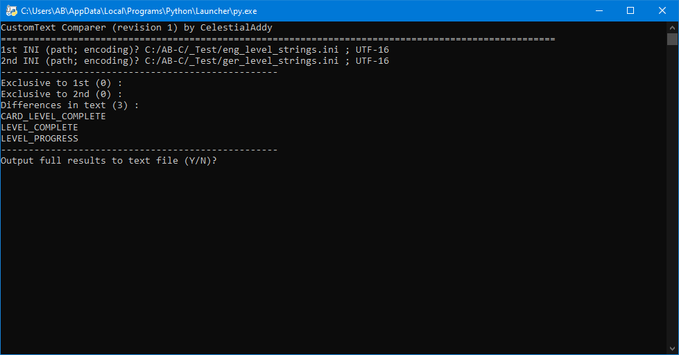

#

# SHR-CustomTextComparer

Python console-UI tool for comparing two plain-text "CustomText"-format/".ini" *The Simpsons: Hit & Run* textbibles.



The output file:
```
Exclusive to 1st (0):
Exclusive to 2nd (0):
Differences in text (3):
	CARD_LEVEL_COMPLETE :
		LEVEL CARDS COLLECTED!
		LEVEL-KARTEN EINGESAMMELT!
	LEVEL_COMPLETE :
		Level Complete
		Level vollendet
	LEVEL_PROGRESS :
		LEVEL PROGRESS
		LEVEL-FORTSCHRITT

```

## Features
- Console-based UI, also has command line support.
- Supports plain-text ".ini" textbibles, either made for mods or exported from the game's P3D textbibles using Lucas' Pure3D Editor.
- Compatible with subsets/result pool text files produced by [**CustomTextSearcher**](https://github.com/CelestialAddy/SHR-CustomTextSearcher).
- Handles technicalities/edge cases (see "Technical Notes" below).
- Compare two textbibles, output limited results to console and optionally output full results to text file.
- Made in Python 3, can be run on any platform where there's a Python interpreter.
- Free for reuse/etc.

## Installing, Running, and Usage
A Python 3 interpreter is required, see [**the Python website**](https://python.org).
  
Requires the "sys" standard library module and the custom "CTDump" module in the included "Module" directory.
  
Depending on your system and how Python is installed, running the program might be as simple as double-clicking/running "CTComparer.py".
Otherwise, you'd need to use the command line (system/setup-dependant) to run "CTComparer.py" under your Python interpreter.

Usage can be divided into five steps:
1. Enter the path and encoding of the 1st textbible, in the format "path;encoding", i.e. `C:/Test1.ini;UTF-8`.
2. Enter the path and encoding of the 2nd textbible, in the format "path;encoding", i.e. `C:/Test2.ini;UTF-8`.
3. The names of every string that is exclusive or different are printed (but not the associated texts).
4. Enter "Y" or "N" to accept or decline outputting the full results (with both strings and texts included) to a text file.
5. Enter the path and encoding of the output text file, in the format "path;encoding", i.e. `C:/Test3.ini;UTF-8`.

Command-line users can launch the tool as `CTComparer.py <in1_path> <in1_encoding> <in2_path> <in2_encoding> <out_path> <out_encoding>`.

If an error is encountered, a message will be printed/prompted alerting you.
If you are experiencing output errors, it can help to ensure the directory you're outputting to already exists.

## Technical Notes
- The program can technically support textbibles of any encoding also supported by the "codecs" standard library module; [**see list**](https://docs.python.org/3.13/library/codecs.html#standard-encodings).
- By design, formatting features within Texts (escapes, newlines, extra quotations, CustomText Variables, and such) are preserved and comparable - texts do not get formatted to appear as they would in-game in any sense.
- Both ";"/"#" INI-comments are supported/excluded (as the Launcher does), as well as inclusion of those characters within Texts via the "\\" escape character.
- CustomText INI sections are handled.
	- Pairs found under a "[CustomText]" section (or under no section) have no prefix added.
	- Pairs found under a level/mission/side-mission-specific section have their locality followed by "::" prefixed (i.e. "L1M2::MISSION_OBJECTIVE_00").
	- Pairs found under a "[Miscellaneous]" section are ignored entirely.
	- Pairs found under a "[Variables]" section are prefixed with "VARIABLES::".

#
